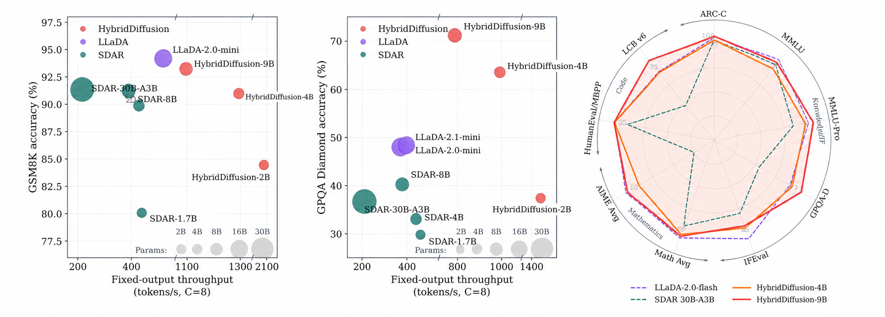
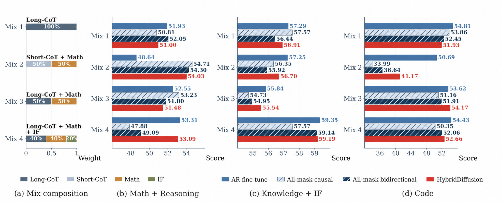

<p align="center">
  
</p>

<p align="center"><strong>Diffusion for Hybrid Language Model</strong></p>

<p align="center">
  <a href="https://arxiv.org/abs/2606.01774">Paper</a> ·
  <a href="#model-zoo">Models</a> ·
  <a href="#training">Training</a> ·
  <a href="eval/README.md">Evaluation & Inference</a>
</p>

<p align="center">
  <a href="https://arxiv.org/abs/2606.01774"></a>
  <a href="#model-zoo"></a>
  <a href="LICENSE"></a>
  <a href="eval/LICENSE"></a>
</p>

HybridDiffusion is a systematic framework for converting hybrid-attention
autoregressive language models into capable diffusion language models. It
combines data-efficient transfer, a token-equal clean/noisy training objective,
specialized Gated DeltaNet kernels, and a unified serving stack. The same
checkpoint supports both **AR-Trust** verified decoding and
**Diffusion-Trust** parallel denoising.

## Overview

<p align="center">
  
</p>

<p align="center"><sub><b>Quality and fixed-output throughput.</b> HybridDiffusion combines strong benchmark performance with high sampling throughput across the 2B, 4B, and 9B scales.</sub></p>

### Highlights

- **One checkpoint, two decoding modes.** AR-Trust uses the clean stream to
  verify noisy-stream drafts; Diffusion-Trust commits tokens through parallel
  block denoising.
- **Data-first AR-to-diffusion transfer.** The released recipe mixes long-form
  reasoning, mathematics, and instruction-following data at
  `0.4 / 0.4 / 0.2`.
- **Hybrid-attention training.** Two-stream Gated DeltaNet and ShortConv
  kernels implement block-diffusion visibility without contaminating the
  causal stream.
- **End-to-end release.** This repository includes data preparation,
  TorchTitan-based distributed training, checkpoint conversion, SGLang serving,
  and the complete paper evaluation suite.

## Model zoo

The released checkpoints use the standard Hugging Face layout and load
directly in the bundled evaluation runtime.

| Model | Checkpoint | Base model |
|---|---|---|
| HybridDiffusion-2B | [HybridDiffusion-2B](https://huggingface.co/yuchen-zhu-zyc/HybridDiffusion-2B) | [Qwen3.5-2B](https://huggingface.co/Qwen/Qwen3.5-2B) |
| HybridDiffusion-4B | [HybridDiffusion-4B](https://huggingface.co/yuchen-zhu-zyc/HybridDiffusion-4B) | [Qwen3.5-4B](https://huggingface.co/Qwen/Qwen3.5-4B) |
| HybridDiffusion-9B | [HybridDiffusion-9B](https://huggingface.co/yuchen-zhu-zyc/HybridDiffusion-9B) | [Qwen3.5-9B](https://huggingface.co/Qwen/Qwen3.5-9B) |

## Results

Selected AR-Trust results from the paper are shown below. See the
[paper](https://arxiv.org/pdf/2606.01774) for the complete comparison and the
[evaluation guide](eval/README.md#paper-results) for both HybridDiffusion decoding modes.

| Model | ARC-C | MMLU-Pro | GPQA-D | IFEval | MATH-500 | AIME-24 | HumanEval | LCB v6 |
|---|---:|---:|---:|---:|---:|---:|---:|---:|
| HybridDiffusion-2B | 85.07 | 53.57 | 37.37 | 68.95 | 84.40 | 31.11 | 64.02 | 15.43 |
| HybridDiffusion-4B | 93.52 | 71.14 | 63.64 | 73.20 | 94.20 | 58.89 | 93.29 | 41.71 |
| HybridDiffusion-9B | 96.33 | 77.39 | 71.21 | 71.35 | 95.20 | 63.33 | 92.07 | 49.71 |

## Repository layout

| Path | Description |
|---|---|
| [`torchtitan/`](torchtitan/) | TorchTitan-based distributed training runtime |
| [`torchtitan/experiments/qwen3_5/`](torchtitan/experiments/qwen3_5/) | HybridDiffusion configurations and Hugging Face/DCP conversion |
| [`torchtitan/models/qwen3_5/`](torchtitan/models/qwen3_5/) | Qwen3.5 HybridDiffusion model, objective, and kernels |
| [`torchtitan/hf_datasets/`](torchtitan/hf_datasets/) | Packed SFT loading and weighted dataset mixtures |
| [`scripts/`](scripts/) | Environment, data-preparation, and training launchers |
| [`eval/`](eval/) | AR-Trust, Diffusion-Trust, causal serving, and evaluation |

## Quick start

Training and evaluation use separate uv environments because their pinned
runtime stacks differ.

### Training environment

Requirements: Linux, Python 3.11, an NVIDIA CUDA GPU, and
[`uv`](https://docs.astral.sh/uv/). The setup has been validated on H100 GPUs.

```bash
bash scripts/setup_envs_models_qwen35.sh \
  --venv /persistent/venvs/hybrid-diffusion-train

source /persistent/venvs/hybrid-diffusion-train/bin/activate
```

### Evaluation environment

```bash
HYBRID_DIFFUSION_CACHE_ROOT=/persistent/hybrid-diffusion-cache \
  bash eval/scripts/setup_eval_env.sh
```

Serve a released checkpoint in either HybridDiffusion decoding mode:

```bash
eval/scripts/serve.sh diffusion yuchen-zhu-zyc/HybridDiffusion-2B

PORT=30001 \
  eval/scripts/serve.sh self-spec yuchen-zhu-zyc/HybridDiffusion-2B
```

See the [evaluation and inference guide](eval/README.md) for causal serving,
decoding configurations, and benchmark commands.

## Training

### 1. Prepare the initialization checkpoint

HybridDiffusion training starts from the corresponding Qwen3.5 autoregressive
checkpoint. The setup script can download the model while creating the
environment:

```bash
HF_TOKEN=... bash scripts/setup_envs_models_qwen35.sh \
  --venv /persistent/venvs/hybrid-diffusion-train \
  --model-id Qwen/Qwen3.5-2B \
  --model-dir /persistent/models/Qwen3.5-2B
```

Convert the Hugging Face checkpoint to TorchTitan DCP:

```bash
source /persistent/venvs/hybrid-diffusion-train/bin/activate

python -m torchtitan.experiments.qwen3_5.convert_from_hf \
  --input_dir /persistent/models/Qwen3.5-2B \
  --output_dir /persistent/checkpoints/Qwen3.5-2B-dcp \
  --model_name qwen3_5 \
  --model_flavor 2B
```

Use the matching model ID and flavor for the 4B and 9B recipes.

### 2. Prepare the data

<p align="center">
  
</p>

<p align="center"><sub><b>Transfer-data composition.</b> The released recipe combines long-form reasoning, mathematics, and instruction-following data.</sub></p>

The three processed Hugging Face Arrow datasets live below one `DATA_ROOT`:

| Dataset key | Directory | Weight |
|---|---|---:|
| `nemotron_long_sft_3k` | `Long-SFT-3K` | 0.4 |
| `nemotron_math_domain` | `Nemotron-Math-Domain` | 0.4 |
| `nemotron_if_domain_cascade` | `Nemotron-IF-Domain-Cascade` | 0.2 |

The builders normalize conversations and reasoning fields into a shared Arrow
schema. Follow the [data-preparation guide](scripts/dataset.md) for source
datasets, expected layouts, filtering, and build commands.

```bash
export DATA_ROOT=/persistent/data/hybrid_diffusion
```

### 3. Select a configuration

| Model | Configuration | Local batch | Global batch | Sequence | Steps | Save interval |
|---|---|---:|---:|---:|---:|---:|
| 2B | [`hybrid_diffusion_2b.toml`](torchtitan/experiments/qwen3_5/train_configs/hybrid_diffusion_2b.toml) | 8 | 256 | 4,096 | 9,000 | 250 |
| 4B | [`hybrid_diffusion_4b.toml`](torchtitan/experiments/qwen3_5/train_configs/hybrid_diffusion_4b.toml) | 4 | 256 | 4,096 | 9,000 | 100 |
| 9B | [`hybrid_diffusion_9b.toml`](torchtitan/experiments/qwen3_5/train_configs/hybrid_diffusion_9b.toml) | 4 | 256 | 4,096 | 9,000 | 100 |

All three recipes use `warmup_steps = 100`, `block_size = 3`,
`ar_loss_weight = 1.0`, and `loss_auto_balance = false`. The internal block
size implements logical block size `B=4` under the shifted objective.

### 4. Launch training

Run the launcher from an allocated GPU node:

```bash
export VENV_PATH=/persistent/venvs/hybrid-diffusion-train
export MODEL_PATH=/persistent/models/Qwen3.5-2B
export DATA_ROOT=/persistent/data/hybrid_diffusion
export INIT_DCP=/persistent/checkpoints/Qwen3.5-2B-dcp
export OUTPUT_DIR=/persistent/outputs/test

GPUS_PER_NODE=8 bash scripts/run_training.sh \
  torchtitan/experiments/qwen3_5/train_configs/hybrid_diffusion_2b.toml \
  --checkpoint.initial-load-path="${INIT_DCP}"
```

For a multi-node Slurm allocation, the same launcher derives the rendezvous
address and node ranks from Slurm:

```bash
NNODES="${SLURM_NNODES}" GPUS_PER_NODE=8 \
  bash scripts/run_training.sh \
    torchtitan/experiments/qwen3_5/train_configs/hybrid_diffusion_2b.toml \
    --checkpoint.initial-load-path="${INIT_DCP}"
```

### Logging and resume

W&B and TensorBoard are disabled by default. Enable either integration through
the launcher environment:

```bash
ENABLE_WANDB=1 ENABLE_TENSORBOARD=1 \
WANDB_ENTITY=your-entity WANDB_PROJECT=your-project \
  bash scripts/run_training.sh path/to/config.toml
```

W&B reads `WANDB_API_KEY` from the environment and uses its public endpoint.
Reuse the same `OUTPUT_DIR` and `RUN_NAME` to resume from the newest compatible
checkpoint.

## Evaluation and inference

The bundled SGLang/FlashInfer runtime exposes three interfaces:

| Mode | Behavior |
|---|---|
| **AR-Trust** | Draft with the noisy stream and verify with clean-stream logits |
| **Diffusion-Trust** | Commit tokens through confidence-based parallel denoising |
| Causal | Standard left-to-right decoding from the clean stream |

The [evaluation guide](eval/README.md) covers environment installation, model
serving, the complete twelve-task evaluation suite, sampling controls, paper
results, and the core implementation map.

## Citation

If you find HybridDiffusion useful, please cite:

```bibtex
@article{zhu2026flare,
  title   = {FLARE: Diffusion for Hybrid Language Model},
  author  = {Yuchen Zhu and Jing Shi and Chongjian Ge and Hao Tan and
             Yiran Xu and Wanrong Zhu and Jason Kuen and Koustava Goswami and
             Rajiv Jain and Yongxin Chen and Molei Tao and Jiuxiang Gu},
  journal = {arXiv preprint arXiv:2606.01774},
  year    = {2026}
}
```

## Acknowledgements

HybridDiffusion builds on [TorchTitan](https://github.com/pytorch/torchtitan),
[Qwen3.5](https://huggingface.co/Qwen),
[Flash Linear Attention](https://github.com/fla-org/flash-linear-attention),
[SGLang](https://github.com/sgl-project/sglang), and
[FlashInfer](https://github.com/flashinfer-ai/flashinfer). We thank their
authors and the open-source community.

## License

HybridDiffusion-authored code, modifications, and model checkpoints are
licensed under the [PolyForm Noncommercial License 1.0.0](LICENSE). The
evaluation and inference tree includes the same terms in
[eval/LICENSE](eval/LICENSE). Third-party and upstream portions retain the
terms listed in [NOTICE](NOTICE) and [eval/NOTICE](eval/NOTICE).
