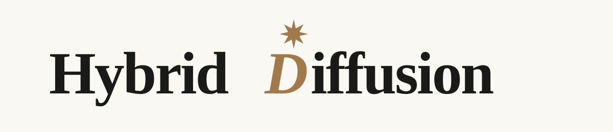

<p align="center">
  <a href="../README.md"></a>
</p>

<p align="center"><strong>Evaluation & Inference</strong></p>

<p align="center">
  <a href="../README.md">Repository</a> ·
  <a href="#quick-start">Quick Start</a> ·
  <a href="#inference-modes">Inference Modes</a> ·
  <a href="#evaluate">Evaluate</a> ·
  <a href="#paper-results">Results</a>
</p>

<p align="center">
  <a href="https://arxiv.org/abs/2606.01774"></a>
  <a href="LICENSE"></a>
</p>

This directory provides the unified HybridDiffusion serving and evaluation stack. It
pairs a modified SGLang runtime with its matching modified FlashInfer source
to support **AR-Trust** verified decoding, **Diffusion-Trust** parallel
denoising, and ordinary causal generation from the same Qwen3.5 checkpoint.

Keep the SGLang and FlashInfer trees together. Both HybridDiffusion paths rely on the
bundled native block-bidirectional attention mask, Qwen3.5 recurrent-state
handling, and semantic CUDA-graph state.

## Quick start

Requirements: Linux, Python 3.10, an NVIDIA CUDA GPU, and
[`uv`](https://docs.astral.sh/uv/). The setup has been validated on H100 GPUs.

### 1. Install

From this directory:

```bash
HYBRID_DIFFUSION_CACHE_ROOT=/persistent/hybrid-diffusion-cache \
  bash scripts/setup_eval_env.sh
```

`HYBRID_DIFFUSION_CACHE_ROOT` holds the uv environment, Hugging Face downloads, JIT
artifacts, and evaluation outputs so they can be reused across launches.

### 2. Download a checkpoint

```bash
export HYBRID_DIFFUSION_CACHE_ROOT=/persistent/hybrid-diffusion-cache
export HF_HOME="${HYBRID_DIFFUSION_CACHE_ROOT}/huggingface"

"${HYBRID_DIFFUSION_CACHE_ROOT}/venvs/hybrid-diffusion-eval/bin/hf" download \
  yuchen-zhu-zyc/HybridDiffusion-2B
```

Set `HF_TOKEN` in the environment if authentication is required.

### 3. Serve

```bash
# Diffusion-Trust: confidence-based parallel block denoising.
scripts/serve.sh diffusion yuchen-zhu-zyc/HybridDiffusion-2B

# AR-Trust: noisy-stream drafting with clean-stream verification.
PORT=30001 scripts/serve.sh self-spec yuchen-zhu-zyc/HybridDiffusion-2B

# Causal reference: ordinary clean-stream decoding.
PORT=30002 scripts/serve.sh causal yuchen-zhu-zyc/HybridDiffusion-2B
```

Common overrides are `HYBRID_DIFFUSION_CACHE_ROOT`, `EVAL_VENV`, `TP_SIZE`, `PORT`,
`MEM_FRACTION_STATIC`, `MAX_RUNNING_REQUESTS`, and `CUDA_GRAPH_BS`. Additional
SGLang arguments may follow `--`; run `scripts/serve.sh` without arguments for
launcher help.

## Inference modes

| Interface | Trust boundary | Runtime entry | Released configuration |
|---|---|---|---|
| **Diffusion-Trust** | Commit noisy-stream samples through confidence-based block denoising | `LowConfidenceShiftHybridDiffusion` | [`hybrid_diffusion_shift_b3_g1.yaml`](configs/hybrid_diffusion_shift_b3_g1.yaml) |
| **AR-Trust** | Treat noisy-stream samples as drafts and verify them with clean-stream logits | `HybridDiffusionSelfSpec` | [`hybrid_diffusion_self_spec_b7_g4.yaml`](configs/hybrid_diffusion_self_spec_b7_g4.yaml) |
| Causal | Decode left-to-right from the clean stream | Native SGLang causal decode | — |

The Diffusion-Trust configuration uses the runtime block
`[current seed, MASK, MASK]`. Its final shifted logit produces the next block's
seed, so runtime `block_size: 3` implements logical block size `B=4`.

AR-Trust uses speculation horizon `N=4` and maximum active width `2N-1=7`: one
anchor, up to three verification rows, and three bidirectional draft rows. The
released configuration selects the paper's Exact-Truncated policy
(`draft_mode: strict_truncated`). Softmax-Argmax
(`argmax_softmax_verify`) and Truncated-Argmax
(`argmax_truncated_verify`) remain available as explicit policy alternatives.

## Model zoo

| Model | Hugging Face checkpoint | Weights | Architecture |
|---|---|---|---|
| HybridDiffusion-2B | [HybridDiffusion-2B](https://huggingface.co/yuchen-zhu-zyc/HybridDiffusion-2B) | BF16 `model.safetensors` | `Qwen3_5DLLMForConditionalGeneration` |
| HybridDiffusion-4B | [HybridDiffusion-4B](https://huggingface.co/yuchen-zhu-zyc/HybridDiffusion-4B) | BF16 `model.safetensors` | `Qwen3_5DLLMForConditionalGeneration` |
| HybridDiffusion-9B | [HybridDiffusion-9B](https://huggingface.co/yuchen-zhu-zyc/HybridDiffusion-9B) | BF16 `model.safetensors` | `Qwen3_5DLLMForConditionalGeneration` |

Each repository includes the model configuration, weights, tokenizer, chat
template, and preprocessing metadata required by the runtime. The native mask
ID is `248077`; it is a valid model-vocabulary ID but intentionally not a
tokenizer token.

No conversion is needed for these released checkpoints. Use
[`scripts/convert_qwen35_dcp_to_hf.py`](scripts/convert_qwen35_dcp_to_hf.py)
only when exporting a TorchTitan DCP training checkpoint.

## Evaluate

Start one or more servers, then run the complete evaluation suite:

```bash
PORTS="30000 30001" \
TASKS="gsm8k math500 ifeval humaneval mbpp arc_c gpqa aime2024 aime2025 mmlu mmlu_pro lcb" \
  scripts/evaluate.sh
```

Each evaluator writes detailed generations, a score summary, the executed
command, and a run manifest. Sampling is controlled by `TEMPERATURE`, `TOP_P`,
`TOP_K`, `PRESENCE_PENALTY`, `ENABLE_THINKING`, `MAX_TOKENS`, and `SEED`.
Defaults are temperature `1.0`, top-p `0.95`, top-k `20`, and presence penalty
`1.5`.

AR-Trust's algorithm configuration independently uses top-k `50` for its
proposal and verification law. Request sampling and algorithm sampling are
separate protocol layers and should both be reported. GPQA-Diamond requires
accepted Hugging Face dataset access and an `HF_TOKEN`; the other eleven task
routes use public dataset loaders.

The MATH-500 launchers under `scripts/benchmarks/` provide one command per
released HybridDiffusion checkpoint and supported comparison model. Each launcher starts
the matching server, evaluates all 500 problems, writes its results below
`HYBRID_DIFFUSION_CACHE_ROOT`, and shuts the server down. To run the complete matrix
sequentially:

```bash
scripts/benchmarks/run_math500_all.sh
```

To evaluate one model family, invoke its launcher directly:

```bash
scripts/benchmarks/run_math500_hybrid_diffusion_4b.sh
scripts/benchmarks/run_math500_sdar_8b.sh
```

Model paths default to their Hugging Face IDs. They can be replaced with a
pre-downloaded checkpoint through the corresponding `*_MODEL_PATH` override;
run `scripts/benchmarks/run_math500_model.sh --help` for the supported model
keys.

## Paper results

The tables below reproduce the HybridDiffusion columns from Tables 1 and 2 of the paper.
Each AR-Trust/Diffusion-Trust pair uses the same checkpoint. An asterisk marks
diffusion code scores identified in the paper as potentially under-reported
because of answer extraction and long-output truncation.

### Knowledge and instruction following

| Model | Mode | ARC-C | MMLU | MMLU-Pro | GPQA-D | IFEval |
|---|---|---:|---:|---:|---:|---:|
| HybridDiffusion-2B | AR-Trust | 85.07 | 67.60 | 53.57 | 37.37 | 68.95 |
| HybridDiffusion-2B | Diffusion-Trust | 85.84 | 64.14 | 53.63 | 35.35 | 62.66 |
| HybridDiffusion-4B | AR-Trust | 93.52 | 78.73 | 71.14 | 63.64 | 73.20 |
| HybridDiffusion-4B | Diffusion-Trust | 94.62 | 79.54 | 70.95 | 64.65 | 73.57 |
| HybridDiffusion-9B | AR-Trust | 96.33 | 84.80 | 77.39 | 71.21 | 71.35 |
| HybridDiffusion-9B | Diffusion-Trust | 95.65 | 80.75 | 74.73 | 64.65 | 63.22 |

### Mathematics

| Model | Mode | GSM8K | MATH-500 | AIME-24 | AIME-25 |
|---|---|---:|---:|---:|---:|
| HybridDiffusion-2B | AR-Trust | 84.46 | 84.40 | 31.11 | 26.67 |
| HybridDiffusion-2B | Diffusion-Trust | 82.79 | 82.20 | 31.11 | 26.67 |
| HybridDiffusion-4B | AR-Trust | 91.05 | 94.20 | 58.89 | 43.33 |
| HybridDiffusion-4B | Diffusion-Trust | 91.58 | 91.60 | 55.56 | 46.67 |
| HybridDiffusion-9B | AR-Trust | 93.33 | 95.20 | 63.33 | 54.44 |
| HybridDiffusion-9B | Diffusion-Trust | 93.10 | 93.60 | 60.00 | 53.33 |

### Code

| Model | Mode | HumanEval | MBPP | LiveCodeBench v6 |
|---|---|---:|---:|---:|
| HybridDiffusion-2B | AR-Trust | 64.02 | 68.09 | 15.43 |
| HybridDiffusion-2B | Diffusion-Trust | 50.61* | 55.25* | 9.71* |
| HybridDiffusion-4B | AR-Trust | 93.29 | 89.11 | 41.71 |
| HybridDiffusion-4B | Diffusion-Trust | 83.54* | 77.82* | 12.57* |
| HybridDiffusion-9B | AR-Trust | 92.07 | 91.05 | 49.71 |
| HybridDiffusion-9B | Diffusion-Trust | 82.32* | 82.10* | 5.71* |

## Implementation map

| Responsibility | Core implementation |
|---|---|
| Diffusion-Trust denoising and causal-state commit | `LowConfidenceShiftHybridDiffusion.run`, `_set_denoise_flags`, `_set_commit_flags` in `sglang/srt/dllm/algorithm/low_confidence_shift_hybrid_diffusion.py` |
| AR-Trust drafting, verification, correction, and request state | `HybridDiffusionSelfSpec.run` in `sglang/srt/dllm/algorithm/hybrid_diffusion_self_spec.py` |
| Exact-Truncated and argmax verification | `fused_sparse_spec_verify`, `fused_spec_verify_from_logits`, `sample_sparse_probs` in `fused_verify_kernel.py` |
| Request phases, KV trimming, batching, and lifecycle | `ReqDllmMixin`, `SchedulerDllmMixin`, `DllmManager` |
| Block-bidirectional softmax-attention mask | `_build_dllm_bidir_block_mask`, `FlashInferAttnBackend` |
| Qwen3.5 recurrent state | `Qwen3_5GatedDeltaNet.forward` and the Qwen3.5 GDN backends |
| Semantic CUDA-graph capture and replay | `CudaGraphRunner` and the dLLM fields in `DecodeInputBuffers` |
| Native mask planning and execution | Paired code under `third_party/flashinfer/flashinfer`, `include/`, and `csrc/` |

Qwen3.5 AR-Trust requires radix cache and the Mamba `extra_buffer` state
strategy. `scripts/serve.sh self-spec` selects this configuration and rejects
incompatible cache or state-buffer options before startup.

## Directory layout

- `sglang/` — SGLang runtime, Qwen3.5 integration, scheduling, cache/state,
  CUDA graphs, sampling, and HybridDiffusion algorithms.
- `third_party/flashinfer/` — paired modified FlashInfer Python, JIT, and
  native sources.
- `configs/` — released Diffusion-Trust and AR-Trust configurations.
- `benchmark_clients/` — twelve paper-task clients, extraction, scoring, and code
  execution support.
- `scripts/setup_eval_env.sh` — one-shot uv environment installation.
- `scripts/serve.sh` — persistent-storage serving launcher.
- `scripts/evaluate.sh` — full paper-task evaluation launcher.
- `scripts/benchmarks/` — complete MATH-500 model launchers.
- `scripts/convert_qwen35_dcp_to_hf.py` — TorchTitan DCP-to-Hugging-Face
  conversion.

## License

HybridDiffusion-authored evaluation and inference modifications are licensed
under the [PolyForm Noncommercial License 1.0.0](LICENSE). See
[NOTICE](NOTICE) for SGLang, FlashInfer, and other upstream attribution.
